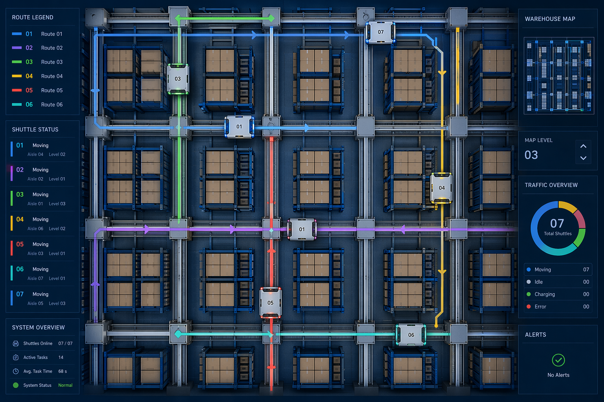
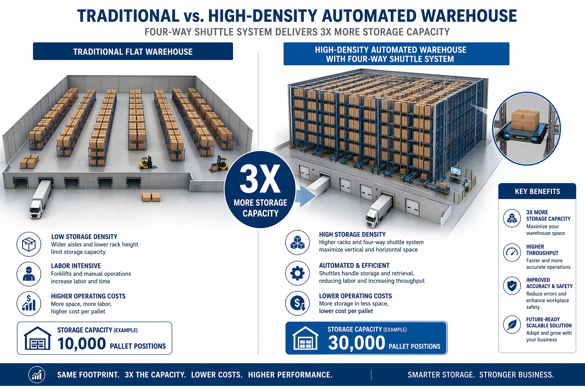

# 别再只看速度！四向穿梭车效率翻倍，真正关键就这5点

> 去年帮一个医药客户做物流中心改造，预算有限，空间就那么大，但老板要求存储量翻一倍、出库效率翻两倍。当时团队里有人建议上AGV，有人说堆垛机更成熟，还有人直接说再租一个仓库。我看了看现场条件，提了一个方案：四向穿梭车。没人信。

---

## 第一个秘密，别看单机速度，看系统吞吐

很多人评价四向穿梭车，第一反应是看单机速度。这车跑多快？一小时能搬多少箱？

坦率的讲，单机速度确实不算快。普通的四向穿梭车，水平运行速度大概在1.5到2米每秒，提升速度在0.5到1米每秒。跟堆垛机比，单机速度差远了。

但问题是，谁告诉你只能用一台？

四向穿梭车最大的优势是柔性。你可以根据业务量，灵活调配车辆数量。旺季加车，淡季减车。一台车慢？上十台。十台还不够？上二十台。

堆垛机能这么干吗？不能。堆垛机是固定设备，装了几台就是几台，你没法临时加。

所以评价四向穿梭车的效率，不能看单机，得看系统整体吞吐量。合理配置的情况下，系统的出入库效率可以达到传统方案的2到3倍。

这个认知很重要。很多项目翻车，就是因为用错了评估标准。

---

## 第二个秘密，路径规划才是真正的技术活

四向穿梭车能在货架的横向和纵向轨道上自由行驶，听起来很灵活对吧？

但灵活也意味着复杂。

如果路径规划做不好，十台车在货架里跑，分分钟堵成一锅粥。你想想，十台车在同一个区域里跑，有的要往左，有的要往上，有的要换层，没有一套好的调度算法，效率还不如人工。

我见过一个项目，花了大价钱买了20台四向穿梭车，结果调度系统没做好，车辆互相等待、互相避让，实际效率只有理论值的40%。

这就是典型的"硬件到位了，软件没跟上"。

好的路径规划要做到三件事：

- **实时感知**：知道每台车的位置和状态
- **提前预判**：让车在到达冲突点之前就调整路线
- **动态分配**：让每台车都跑最优路线

说起来简单，做起来是另一回事。这块建议找有经验的集成商，别自己瞎琢磨。

---

## 第三个秘密，换层效率被严重低估了

传统的立体仓库，换层是个大问题。堆垛机换层要先把货送到提升机，提升机换完层再交给另一台堆垛机。中间多了一次交接，时间就多了一截。

四向穿梭车不一样。它自己就能换层。

通过提升机，四向穿梭车可以带着货物直接从A层跑到B层，不需要二次交接。整个过程是"搬运-存取-换层"一体化的。

这个优势在医药物流里特别明显。医药仓库SKU多，同一个订单里的货可能分布在三四个层。传统方案要反复调度提升机和堆垛机，时间都花在等待和交接上了。

四向穿梭车直接一个车搞定，从A层取完货，自己跑到B层，再跑到C层，最后送到出库口。中间没有等待，没有交接，一气呵成。

我那个医药客户的出库效率之所以能翻2.3倍，换层效率的提升功不可没。

---

## 第四个秘密，空间利用率才是隐藏的大招

四向穿梭车的货架可以做到24米甚至更高。跟传统平面仓库比，存储容量能提升300%以上。

这个数字怎么来的？两个维度。

一个是高度。传统仓库一般5到8米，四向穿梭车的货架可以做到24米。光高度就多了3倍。

另一个是密度。四向穿梭车的巷道很窄，因为它不需要像叉车那样留转弯空间。穿梭车本身就很窄，轨道也很窄，巷道宽度可以压缩到最小。

两个维度叠加，存储密度就上去了。

那个医药客户原来的仓库是平面的，存了大概8000个SKU。改造后同样面积，存了22000个SKU。老板看到这个数据的时候，当场就说再租仓库的事不提了。

还有一个细节。四向穿梭车不需要留那么多通道。传统仓库要给叉车留通道，通道面积占了整个仓库的30%到40%。四向穿梭车的通道面积占比可以降到10%以下。

省出来的面积，全是存储空间。

---

## 第五个秘密，维护成本比你想象的低

很多人觉得自动化设备维护成本高。确实，堆垛机的维护成本不低，因为它是一台复杂的大型设备，坏了就得停整个巷道。

四向穿梭车不一样。它是分布式系统，一台车坏了，其他车继续跑。不会因为一台车的故障导致整个系统停摆。

而且四向穿梭车的单体成本相对低，备件也便宜。你可以备两台车在仓库里，坏了直接换，十分钟搞定。堆垛机你能备一台吗？那成本你算算。

能耗方面，四向穿梭车也更省。单台车的功率一般在1到2千瓦，比堆垛机低得多。20台车同时跑，也就30到40千瓦。堆垛机一台就十几千瓦了。

还有一个隐性成本，人工。四向穿梭车配合WMS系统，可以实现7乘24小时无人值守。百事可乐在上海的智慧物流中心，就是用四向穿梭车实现了"黑灯仓库"，40000个库位，全天候自动运转。

---

## 写在最后

说完这5个秘密，回到开头那个项目。

存储密度提升280%，出库效率提升2.3倍，投入回收期大概3年。

这个结果不是四向穿梭车一个设备的功劳，是整个系统设计的功劳。设备选型、路径规划、WMS对接、人员培训，缺一环都不行。

如果你也在考虑仓库改造，我的建议是，先别急着定方案。把你的业务数据、场地条件、预算范围理清楚，再找有经验的集成商聊。

四向穿梭车不是万能的。业务量太小、SKU太单一、场地条件太差的场景，可能不太适合。但如果你是做医药、快消、电商这些SKU多、订单波动大的行业，值得认真考虑。

本文都是实战总结，没有虚头巴脑的理论，建议收藏转发给做仓储规划、设备采购的同事，选型少走弯路。

---

**毅哥说物流** | 20多年医药物流全链路实战专家

聚焦于医药生产工艺优化、医药企业信息化咨询及绿色能源改造升级

致力于用AI与数字技术驱动医药企业精益增长

更多干货，关注：https://wuliu-coclaw.github.io/Github/

*数据来源说明：本文效率数据基于作者25年从业经验及实际项目案例，具体效果因场地条件、设备配置、业务量等因素存在差异，仅供参考。*
